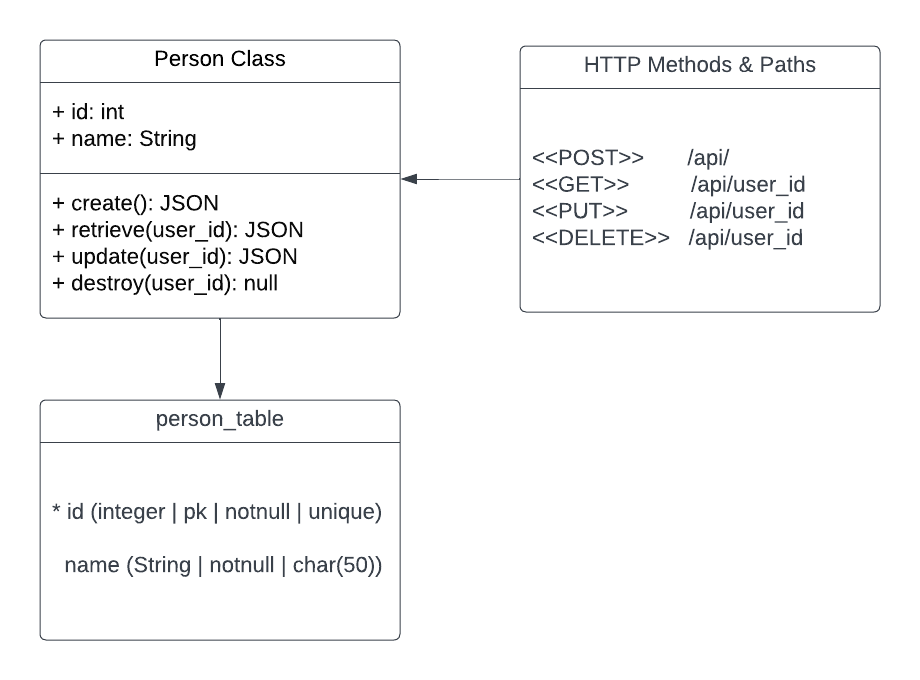

# HNGx-stage2-task2

Contents

- 
- 
- 
- 
- 

## 1. Introduction

A simple REST API capable of CRUD operations on a "person" resource, by providing
the user `name` as request parameter and getting the user data back.
This API was written in Python programming language,
with Django and Django Rest Framework for rapid development.
And also interfacing with a Postgres database.

## 2. Data format

**Request body:**

```json
{
  "name": "Mark Essien"
}
```

**Respoce data:**

```json
{
  "id": 1,
  "name": "Mark Essien"
}
```

## 3. Available endpoints

- POST: /api/
- GET: /api/user_id
- PUT: /api/user_id
- DELETE: /api/user_id

## 4. Project setup

As this project was written in Python programming language, make sure you have python installed on you system and also `git`. You can check by typing `python --version` to your terminal. Clone this projec tto you local machine and install all the dependencies by running `pip install -r requirements.txt` which contains all the dependecies used in this project. Configure a postgres database and provide all the neccesary variables in an environment variable file (`.env`), sample variables were provided in `.env-sample` file. After successfully install all the requirements for the project to run, then run it my typing:

```bash
python manage.py runserver
```

## 5. Project Architechture

Here is the diagram that represents the structure and relationships of the API's classes and models

